# ImDisk Virtual Disk Driver - Architecture Documentation

This document explains the architecture and component interactions of the ImDisk Virtual Disk Driver codebase. It covers the C++ kernel driver, user-mode services, command-line tools, control panel applet, and .NET wrapper libraries.

## Table of Contents

- [Overview](#overview)
- [High-Level Architecture](#high-level-architecture)
- [Component Breakdown](#component-breakdown)
  - [Kernel Driver (sys/)](#kernel-driver-sys)
  - [Command-Line Interface (cli/)](#command-line-interface-cli)
  - [Proxy Service (svc/)](#proxy-service-svc)
  - [Device I/O Library (devio/)](#device-io-library-devio)
  - [Control Panel Applet (cpl/)](#control-panel-applet-cpl)
  - [AWE Allocation Driver (awealloc/)](#awe-allocation-driver-awealloc)
  - [.NET Libraries (ImDiskNet/)](#net-libraries-imdisknet)
- [Data Flow Diagrams](#data-flow-diagrams)
- [Key Data Structures](#key-data-structures)
- [IOCTL Interface](#ioctl-interface)
- [Proxy Protocol](#proxy-protocol)

---

## Overview

ImDisk is a virtual disk driver for Windows that emulates:
- **Hard disk partitions**
- **Floppy drives**
- **CD/DVD-ROM drives**

These virtual disks can be backed by:
1. **Image files** on disk
2. **Virtual memory** (RAM disk)
3. **Physical memory** via AWEAlloc driver
4. **Proxy connections** (named pipes, TCP/IP, serial ports, shared memory)

---

## High-Level Architecture

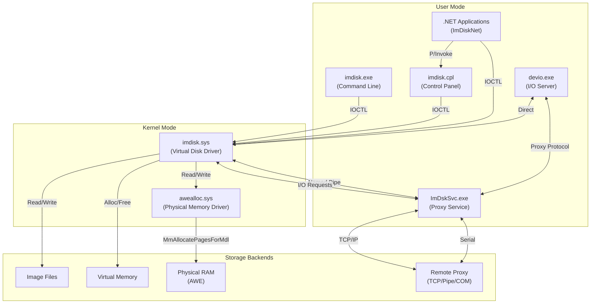

---

## Component Breakdown

### Kernel Driver (sys/)

The core kernel-mode driver that creates and manages virtual disk devices.

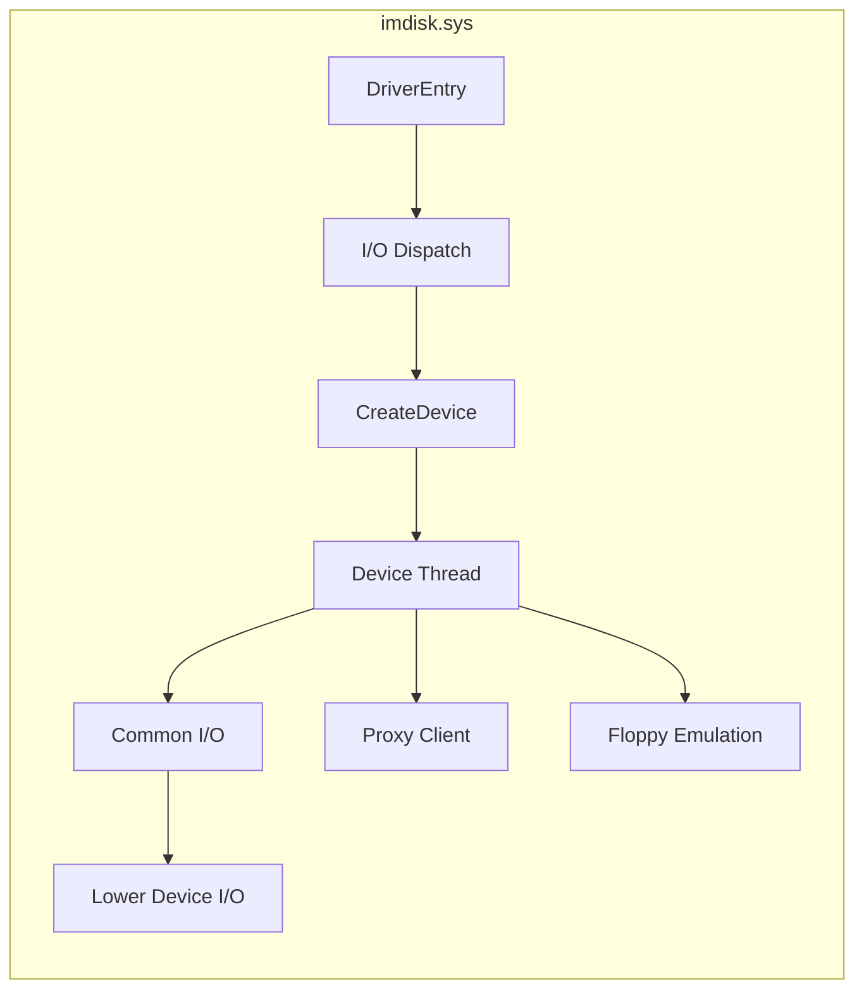

**Key Source Files:**

| File | Purpose |
|------|---------|
| `imdisk.cpp` | Driver entry point and main initialization |
| `iodisp.cpp` | IRP dispatch handlers (Create, Close, Read, Write, DeviceControl) |
| `createdev.cpp` | Device object creation and configuration |
| `devthrd.cpp` | Worker thread for I/O processing |
| `proxy.cpp` | Proxy connection client (pipe, TCP, shared memory) |
| `floppy.cpp` | Floppy disk geometry and format emulation |
| `commonio.cpp` | Common I/O routines |
| `lowerdev.cpp` | Pass-through to underlying storage devices |
| `wkmem.cpp` | Kernel memory management utilities |
| `imdsksys.h` | Internal header with structures and prototypes |

**Device Extension Structure:**

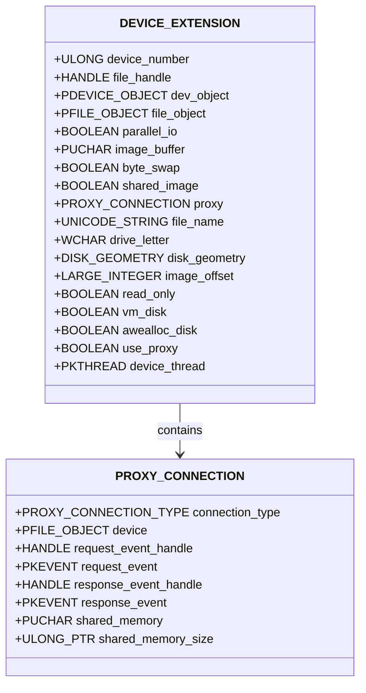

---

### Command-Line Interface (cli/)

User-mode command-line tool for managing virtual disks.

**Source File:** `imdisk.c`

**Capabilities:**
- `-a` : Attach (create) virtual disk
- `-d` / `-D` : Detach (remove) virtual disk
- `-l` : List virtual disks
- `-e` : Edit existing virtual disk
- `-R` : Emergency removal

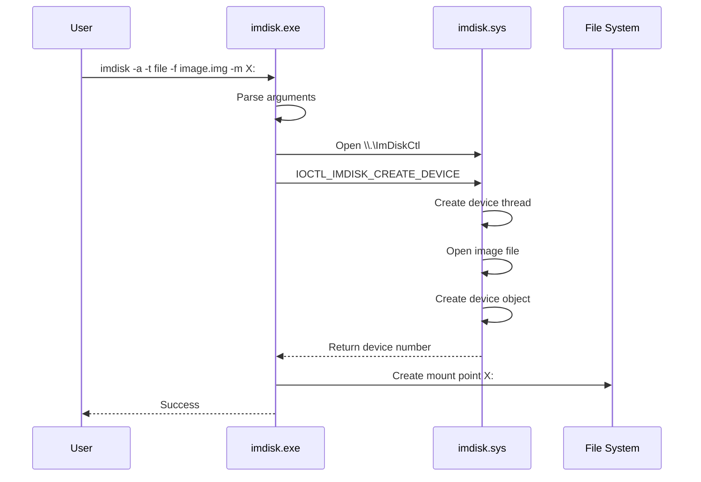

---

### Proxy Service (svc/)

Windows service that forwards I/O requests to remote storage.

**Source File:** `imdsksvc.cpp`

**Functions:**
- Accepts connections from kernel driver via named pipe
- Forwards I/O to TCP/IP hosts, serial ports, or other endpoints
- Runs as Windows service (ImDskSvc)

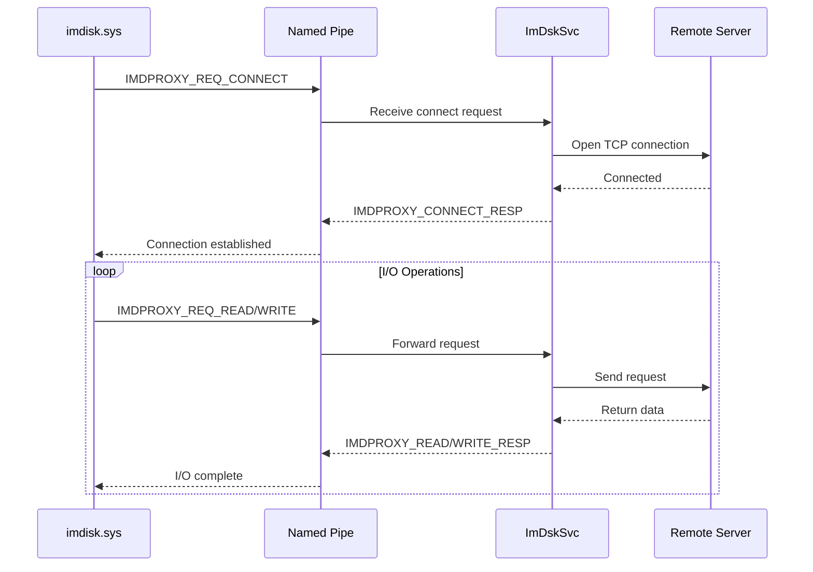

---

### Device I/O Library (devio/)

Cross-platform library for storage server implementations.

**Key Files:**

| File | Purpose |
|------|---------|
| `devio.c` | Core device I/O routines |
| `devio.h` | Public API header |
| `devio_types.h` | Type definitions |
| `safeio.c` | Safe I/O wrappers |
| `win32_fileio.cpp` | Windows file I/O implementation |
| `iobridge/` | Bridge for connecting devio to other systems |

---

### Control Panel Applet (cpl/)

Windows Control Panel interface for managing virtual disks.

**Key Files:**

| File | Purpose |
|------|---------|
| `imdisk.cpp` | Control Panel applet entry and dialogs |
| `drvio.c` | Driver I/O helper functions |
| `mbr.c` | MBR partition table handling |
| `rundll.c` | RunDLL32 compatible entry points |
| `wconmsg.cpp` | Console message output |

The CPL exports a DLL (`imdisk.cpl`) that can be called via:
- Control Panel integration
- `rundll32.exe imdisk.cpl,RunDLL_MountFile filename`

---

### AWE Allocation Driver (awealloc/)

Kernel driver for allocating physical RAM pages for high-performance RAM disks.

**Source File:** `awealloc.c`

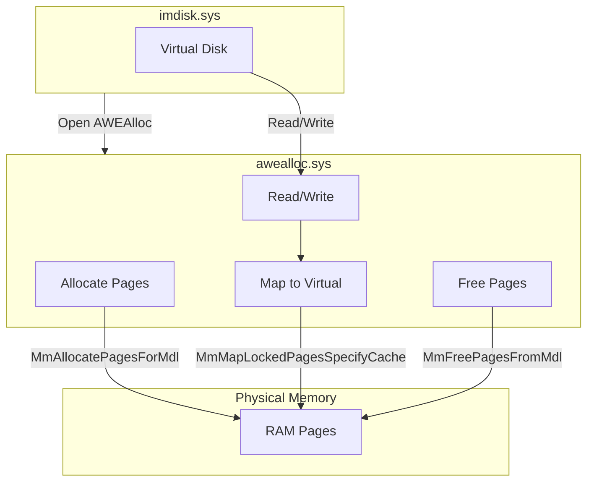

**Key Structures:**

```c
typedef struct _BLOCK_DESCRIPTOR {
    LONGLONG Offset;
    PMDL Mdl;
    struct _BLOCK_DESCRIPTOR *NextBlock;
} BLOCK_DESCRIPTOR;

typedef struct _PAGE_CONTEXT {
    LONGLONG UsageCount;
    LONGLONG PageBase;
    PMDL Mdl;
    PUCHAR Ptr;
} PAGE_CONTEXT;
```

---

### .NET Libraries (ImDiskNet/)

Managed wrappers for the ImDisk API.

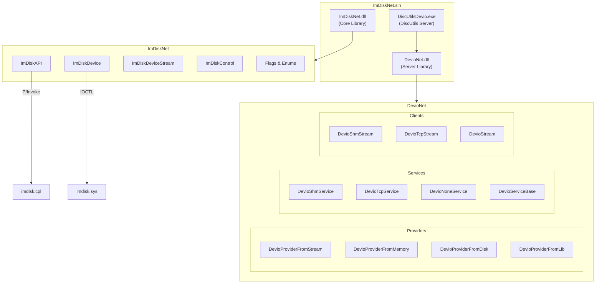

**ImDiskAPI Class Methods:**

```vb
Public Class ImDiskAPI
    ' Create virtual disk
    Public Shared Function CreateDevice(
        DiskSize As Long,
        TracksPerCylinder As UInt32,
        SectorsPerTrack As UInt32,
        BytesPerSector As UInt32,
        ImageOffset As Long,
        Flags As ImDiskFlags,
        FileName As String,
        NativePath As Boolean,
        MountPoint As String) As UInt32

    ' Remove virtual disk
    Public Shared Sub RemoveDevice(DeviceNumber As UInt32)
    
    ' Query device info
    Public Shared Function QueryDevice(DeviceNumber As UInt32) As ImDiskDevice
    
    ' Get list of devices
    Public Shared Function GetDeviceList() As UInt32()
    
    ' Events
    Public Shared Event DriveListChanged As EventHandler
End Class
```

---

## Data Flow Diagrams

### Virtual Disk Creation Flow

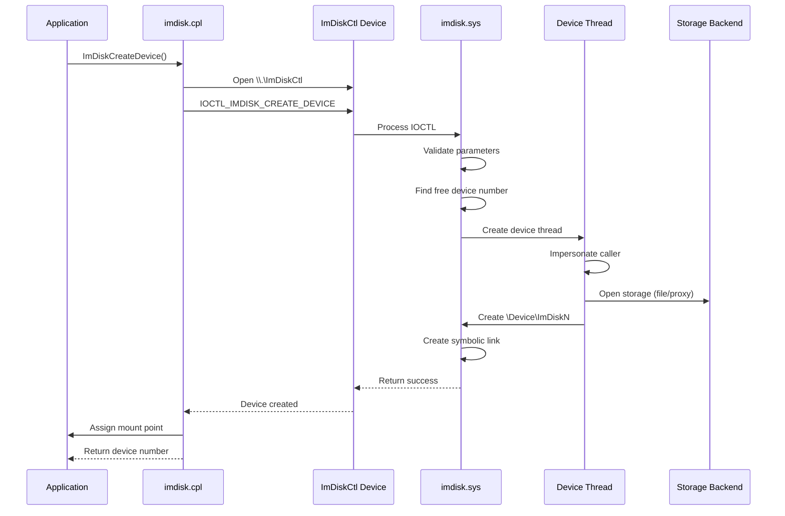

### I/O Request Flow (File-Backed)

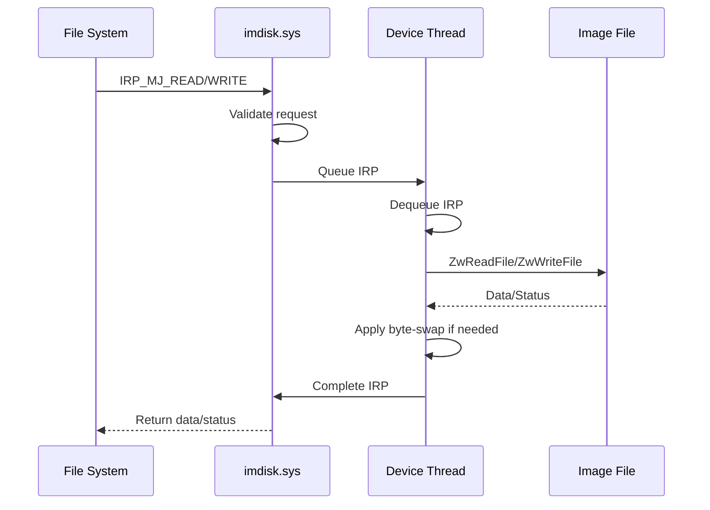

### Proxy I/O Flow

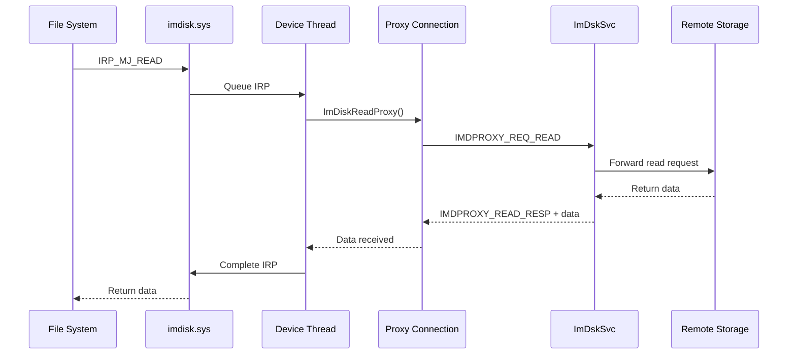

---

## Key Data Structures

### IMDISK_CREATE_DATA

Used for creating and querying virtual disks:

```c
typedef struct _IMDISK_CREATE_DATA {
    ULONG           DeviceNumber;      // Device number (input/output)
    DISK_GEOMETRY   DiskGeometry;      // Virtual geometry (Cylinders = total size)
    LARGE_INTEGER   ImageOffset;       // Offset in image file
    ULONG           Flags;             // Type and option flags
    WCHAR           DriveLetter;       // Drive letter (if used)
    USHORT          FileNameLength;    // Length of FileName
    WCHAR           FileName[1];       // Variable-length filename
} IMDISK_CREATE_DATA;
```

### Device Type Flags

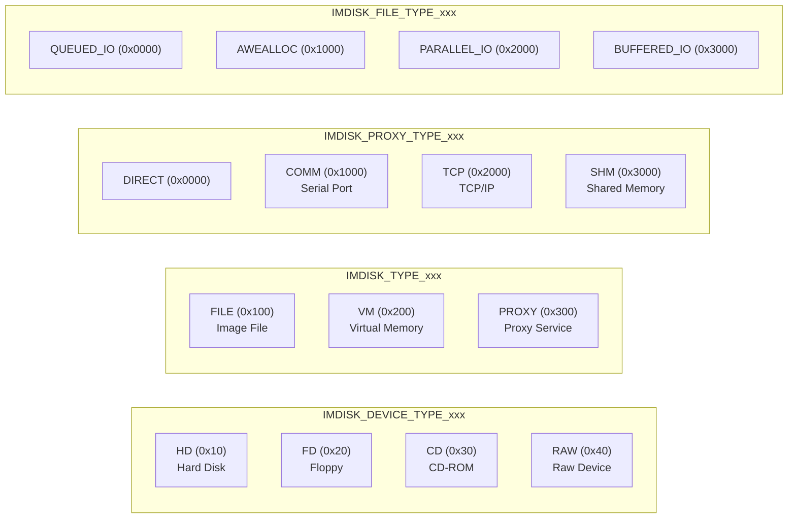

---

## IOCTL Interface

| IOCTL Code | Description |
|------------|-------------|
| `IOCTL_IMDISK_QUERY_VERSION` | Query driver version |
| `IOCTL_IMDISK_CREATE_DEVICE` | Create new virtual disk |
| `IOCTL_IMDISK_QUERY_DEVICE` | Query device parameters |
| `IOCTL_IMDISK_QUERY_DRIVER` | Query driver information |
| `IOCTL_IMDISK_SET_DEVICE_FLAGS` | Modify device flags |
| `IOCTL_IMDISK_REMOVE_DEVICE` | Remove virtual disk |
| `IOCTL_IMDISK_REFERENCE_HANDLE` | Reference a handle in driver |
| `IOCTL_IMDISK_GET_REFERENCED_HANDLE` | Get referenced handle |
| `IOCTL_IMDISK_IOCTL_PASS_THROUGH` | Pass IOCTL to underlying device |
| `IOCTL_IMDISK_FSCTL_PASS_THROUGH` | Pass FSCTL to underlying device |

---

## Proxy Protocol

The proxy protocol uses a simple request/response structure:

### Request Types

```c
typedef enum _IMDPROXY_REQ {
    IMDPROXY_REQ_NULL,      // No operation
    IMDPROXY_REQ_INFO,      // Query disk information
    IMDPROXY_REQ_READ,      // Read data
    IMDPROXY_REQ_WRITE,     // Write data
    IMDPROXY_REQ_CONNECT,   // Connect to storage
    IMDPROXY_REQ_CLOSE,     // Close connection
    IMDPROXY_REQ_UNMAP,     // TRIM/Unmap
    IMDPROXY_REQ_ZERO,      // Zero-fill
    IMDPROXY_REQ_SCSI,      // SCSI pass-through
    IMDPROXY_REQ_SHARED     // Shared access operations
} IMDPROXY_REQ;
```

### Protocol Sequence

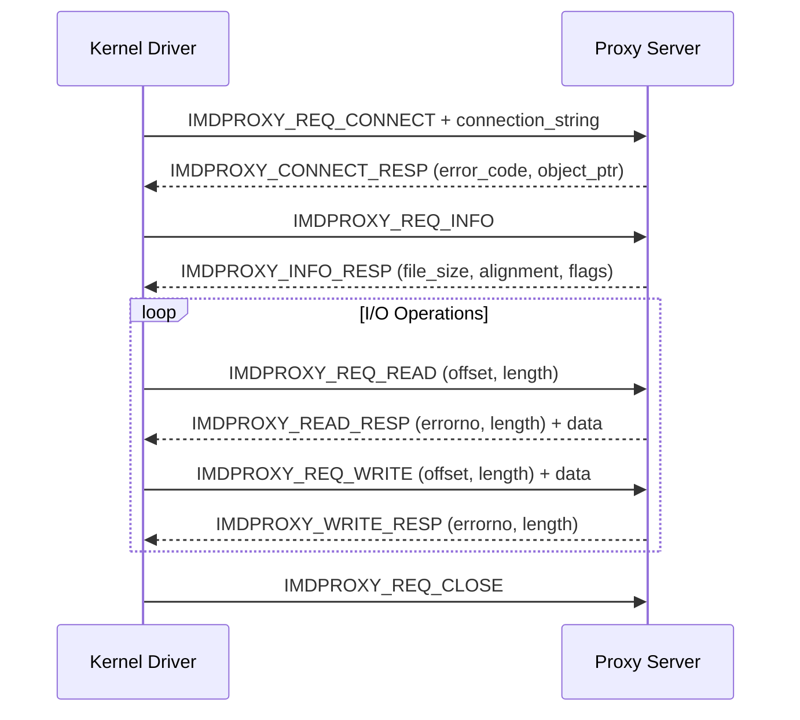

---

## Summary

The ImDisk architecture follows a layered design:

1. **User Interface Layer**: CLI (`imdisk.exe`), CPL (`imdisk.cpl`), .NET (`ImDiskNet`)
2. **API Layer**: IOCTL interface, P/Invoke wrappers
3. **Kernel Layer**: Virtual disk driver (`imdisk.sys`), AWE driver (`awealloc.sys`)
4. **Proxy Layer**: Service (`ImDskSvc`), Protocol implementation
5. **Storage Layer**: Files, memory, network, physical RAM

The modular design allows for:
- Multiple storage backends (file, memory, proxy)
- Multiple device types (HDD, floppy, CD-ROM)
- Remote storage via proxy protocol
- High-performance RAM disks via AWE

---

## References

- **Microsoft Virtual Disk API**: https://docs.microsoft.com/en-us/windows/win32/api/virtdisk/
- **Windows Driver Kit (WDK)**: https://docs.microsoft.com/en-us/windows-hardware/drivers/
- **ImDisk Wiki**: https://github.com/LTRData/ImDisk/wiki

---

*Document generated for ImDisk codebase analysis. Original ImDisk source by Olof Lagerkvist.*
